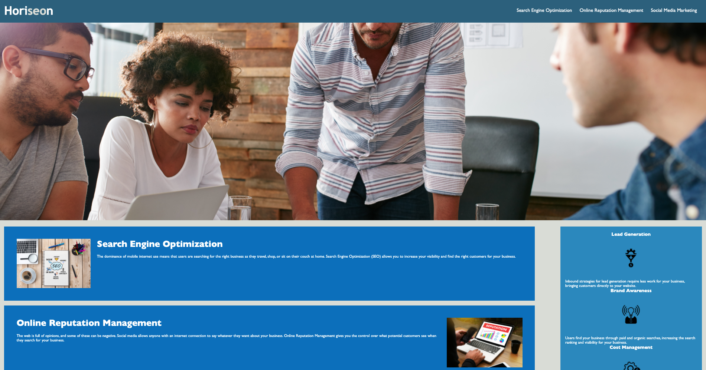

# Horiseon SEO
# Homework fun

## Overview 

As a up and coming developer I have been tasked with consolidating some of the CSS coding to be in line with the semantic elements of my HTML. Working on the Horiseon value propositions I have added accessability elements to the semantics of my HTML file. This results in comporting with accessability standards and helps with SEO rankings. 




<!-- Link here to working github pages -->

Link [Deployed application](https://seanrashby.github.io/Horiseon-SEO/)


## User Story

```
AS A marketing agency
I WANT a codebase that follows accessibility standards
SO THAT our own site is optimized for search engines
```

